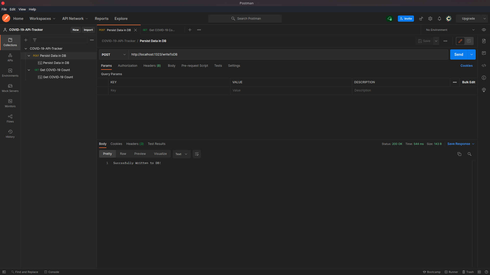

# COVID-19-API-Tracker
A REST API developed using Golang with the Echo Framework and MongoDB Database

The application has made use publicly available COVID-19 dataset from [here](https://nodejs.org/en/) inorder to persist the data in the database. The API has also made use reverse reverse geocoding which is available over [here](https://api.bigdatacloud.net/data/reverse-geocode-client)

# PREVIEW


***


***


<p align="right">(<a href="#user-content-covid-19-api-tracker">back to top</a>)</p>


# Prerequisites
* [Golang](https://golang.org/dl/)
* [Mongo ATLAS](https://www.mongodb.com/)


```bash
# Download this project
git clone https://github.com/geekCyberWarrior/COVID-19-API-Tracker.git
```


# SERVER SETUP
Before running the server you should, 
* set the database config url in the ```.env``` file to the ```MONGODB_URL``` variable


### INSTALLING DEPENDENCIES AND RUNNING
```bash
# Build and Run
go mod download
go run server.go
```


# API Endpoints:-

#### **/writeToDB**
- ```POST``` : Persist Data in Database


#### **/?latitude=&longitude=**
- ```GET``` : Get COVID-19 Data
<p align="right">(<a href="#user-content-covid-19-api-tracker">back to top</a>)</p>
